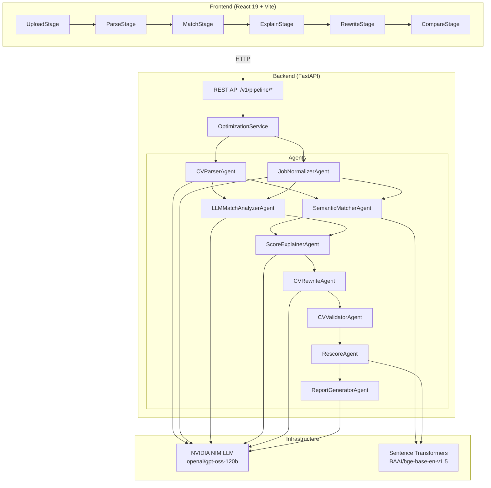
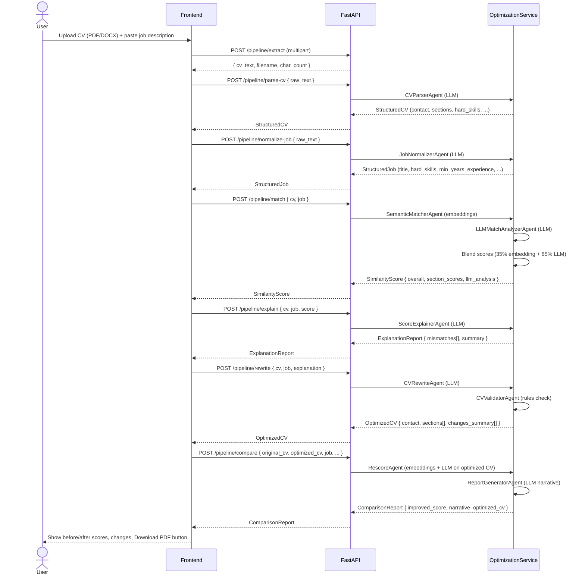
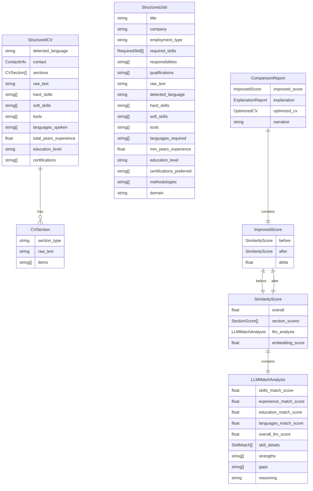
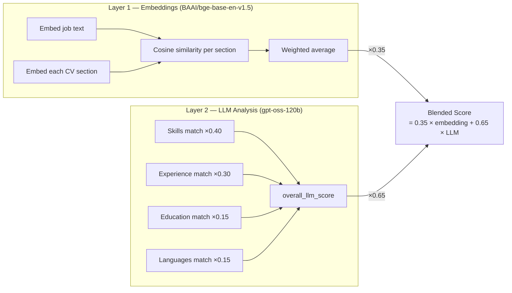
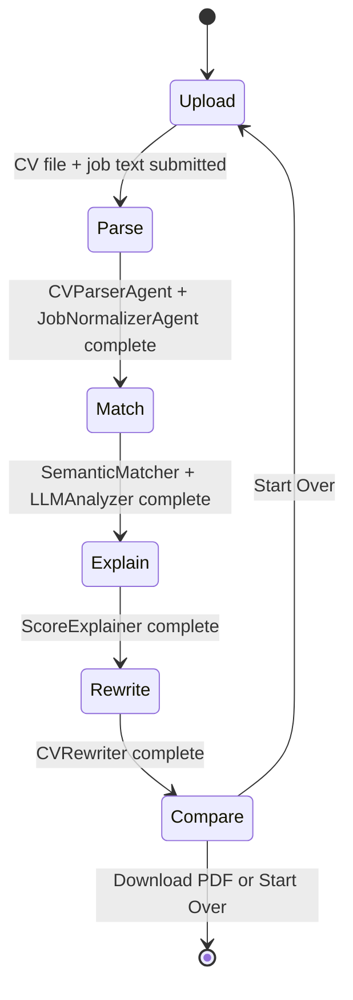
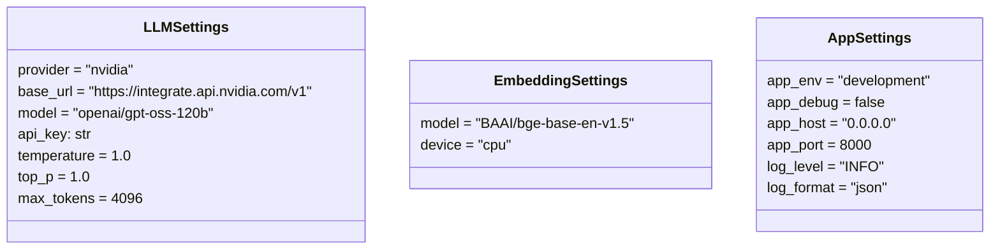

# CV Optima — AI-Powered CV Optimisation System

> Upload your CV + a job description → get a tailored, scored, and rewritten CV in under 60 seconds.

---

## Table of Contents

1. [Overview](#overview)
2. [Architecture](#architecture)
3. [Repository Structure](#repository-structure)
4. [Tech Stack](#tech-stack)
5. [Full Pipeline Workflow](#full-pipeline-workflow)
6. [API Reference](#api-reference)
7. [Agent Catalogue](#agent-catalogue)
8. [Schema Reference](#schema-reference)
9. [Scoring Model](#scoring-model)
10. [Frontend Stages](#frontend-stages)
11. [Configuration](#configuration)
12. [Running Locally](#running-locally)
13. [Testing](#testing)
14. [Environment Variables](#environment-variables)

---

## Overview

CV Optima is a full-stack application that takes a raw CV (PDF or DOCX) and a job description (plain text) and runs them through a 9-step AI pipeline to:

- **Parse** the CV and job into structured, machine-readable schemas
- **Score** the match using a hybrid of dense embeddings + LLM deep analysis
- **Explain** specific gaps between the candidate and the role
- **Rewrite** the CV sections to close those gaps (without inventing experience)
- **Rescore** the optimised CV to measure improvement
- **Export** a clean, professionally formatted PDF

---

## Architecture



---

## Repository Structure

```
resumeshit/
├── resumeoptimiser/          # Python backend (FastAPI)
│   ├── app/
│   │   ├── main.py           # FastAPI app factory
│   │   ├── agents/           # One file per agent
│   │   │   ├── base.py
│   │   │   ├── cv_parser.py
│   │   │   ├── cv_rewriter.py
│   │   │   ├── cv_validator.py
│   │   │   ├── job_normalizer.py
│   │   │   ├── llm_match_analyzer.py
│   │   │   ├── report_generator.py
│   │   │   ├── rescorer.py
│   │   │   ├── score_explainer.py
│   │   │   └── semantic_matcher.py
│   │   ├── api/
│   │   │   ├── deps.py        # Dependency injection wiring
│   │   │   └── v1/routes/
│   │   │       ├── optimize.py
│   │   │       └── pipeline.py  # Stage-by-stage endpoints
│   │   ├── core/
│   │   │   ├── config.py      # pydantic-settings
│   │   │   ├── exceptions.py
│   │   │   └── logging.py
│   │   ├── domain/
│   │   │   └── models.py      # SectionType enum
│   │   ├── infrastructure/
│   │   │   ├── embedding_client.py  # BAAI/bge-base-en-v1.5
│   │   │   ├── llm_client.py        # OpenAI-compatible NIM client
│   │   │   └── vector_store.py
│   │   ├── schemas/
│   │   │   ├── cv.py
│   │   │   ├── job.py
│   │   │   ├── pipeline.py
│   │   │   ├── report.py
│   │   │   └── scoring.py
│   │   └── services/
│   │       └── optimization_service.py  # Pipeline orchestrator
│   ├── tests/
│   │   └── unit/
│   ├── pyproject.toml
│   └── Makefile
│
└── cv-optima/                 # React frontend (Vite)
    ├── src/
    │   ├── App.tsx
    │   ├── api.ts             # Typed API client
    │   ├── components/
    │   │   ├── layout/
    │   │   ├── stages/        # One component per pipeline stage
    │   │   └── ui/
    │   ├── context/
    │   │   └── PipelineContext.tsx
    │   ├── lib/
    │   │   └── exportPdf.ts   # jsPDF CV export
    │   └── types/
    │       └── pipeline.ts    # TypeScript mirror of Python schemas
    ├── package.json
    └── vite.config.ts
```

---

## Tech Stack

| Layer | Technology |
|---|---|
| Frontend | React 19, TypeScript, Vite, Tailwind CSS v4, Framer Motion, jsPDF |
| Backend | Python 3.11+, FastAPI, Uvicorn, Pydantic v2 |
| LLM | NVIDIA NIM — `openai/gpt-oss-120b` (OpenAI-compatible API) |
| Embeddings | `BAAI/bge-base-en-v1.5` via `sentence-transformers` (768 dims) |
| File parsing | `pypdf`, `python-docx` |
| Logging | `structlog` (JSON output) |
| Testing | `pytest`, `pytest-mock` |

---

## Full Pipeline Workflow



---

## API Reference

All endpoints live under `http://localhost:8000/v1/pipeline/`.

### `POST /extract`
Extract raw text from an uploaded CV file.

| Field | Type | Description |
|---|---|---|
| `cv_file` | `UploadFile` | PDF or DOCX |
| `job_text` | `string` (form) | Raw job description |

**Response:** `{ cv_text, filename, char_count }`

---

### `POST /parse-cv`
Run `CVParserAgent` on raw CV text.

**Body:** `{ raw_text: string }`  
**Response:** `StructuredCV`

---

### `POST /normalize-job`
Run `JobNormalizerAgent` on raw job description text.

**Body:** `{ raw_text: string }`  
**Response:** `StructuredJob`

---

### `POST /match`
Hybrid similarity scoring: embeddings + LLM analysis, blended 35/65.

**Body:** `{ cv: StructuredCV, job: StructuredJob }`  
**Response:** `SimilarityScore`

---

### `POST /explain`
LLM-powered gap analysis with actionable mismatch items.

**Body:** `{ cv, job, score }`  
**Response:** `ExplanationReport`

---

### `POST /rewrite`
Rewrite CV sections guided by the explanation. No fabrication.

**Body:** `{ cv, job, explanation }`  
**Response:** `OptimizedCV`

---

### `POST /compare`
Re-score optimised CV and generate the final comparison narrative.

**Body:** `{ original_cv, optimized_cv, job, original_score, explanation, optimized_cv_schema }`  
**Response:** `ComparisonReport`

---

## Agent Catalogue

```mermaid
classDiagram
    class BaseAgent {
        <<abstract>>
        +meta: AgentMeta
        +execute(input) output
    }

    class CVParserAgent {
        +execute(CVParserInput) StructuredCVSchema
        -_build_prompt(raw_text)
        -_parse_response(text)
    }

    class JobNormalizerAgent {
        +execute(JobNormalizerInput) StructuredJobSchema
    }

    class SemanticMatcherAgent {
        -_embedder: EmbeddingClientProtocol
        +execute(SemanticMatcherInput) SimilarityScoreSchema
        -_embed_job(job)
        -_score_sections(cv, job_vec)
        -_skills_embedding_score(cv, job)
        -_compute_overall(section_scores)
    }

    class LLMMatchAnalyzerAgent {
        +execute(SemanticMatcherInput) LLMMatchAnalysisSchema
        -_build_user_message(cv, job)
    }

    class ScoreExplainerAgent {
        +execute(ScoreExplainerInput) ExplanationReportSchema
    }

    class CVRewriteAgent {
        +execute(CVRewriteInput) OptimizedCVSchema
    }

    class CVValidatorAgent {
        +execute(CVValidatorInput) CVValidatorOutput
    }

    class RescoreAgent {
        -_matcher: SemanticMatcherAgent
        -_llm_analyzer: LLMMatchAnalyzerAgent
        +execute(RescoreInput) ImprovedScoreSchema
        -_score_optimized(input)
    }

    class ReportGeneratorAgent {
        +execute(ReportGeneratorInput) ComparisonReportSchema
        -_generate_narrative(input)
    }

    BaseAgent <|-- CVParserAgent
    BaseAgent <|-- JobNormalizerAgent
    BaseAgent <|-- SemanticMatcherAgent
    BaseAgent <|-- LLMMatchAnalyzerAgent
    BaseAgent <|-- ScoreExplainerAgent
    BaseAgent <|-- CVRewriteAgent
    BaseAgent <|-- CVValidatorAgent
    BaseAgent <|-- RescoreAgent
    BaseAgent <|-- ReportGeneratorAgent
```



### Agent Details

| Agent | Transport | Retries | Input | Output |
|---|---|---|---|---|
| `CVParserAgent` | LLM | 2 | `raw_text` | `StructuredCV` |
| `JobNormalizerAgent` | LLM | 2 | `raw_text` | `StructuredJob` |
| `SemanticMatcherAgent` | Embeddings | — | `cv + job` | `SimilarityScore` |
| `LLMMatchAnalyzerAgent` | LLM | 2 | `cv + job` | `LLMMatchAnalysis` |
| `ScoreExplainerAgent` | LLM | 2 | `cv + job + score` | `ExplanationReport` |
| `CVRewriteAgent` | LLM | 2 | `cv + job + explanation` | `OptimizedCV` |
| `CVValidatorAgent` | Rules | — | `original + optimized` | `CVValidatorOutput` |
| `RescoreAgent` | Embeddings + LLM | — | `original_cv + optimized_cv + job` | `ImprovedScore` |
| `ReportGeneratorAgent` | LLM | — | `improved_score + explanation + optimized_cv` | `ComparisonReport` |

---

## Schema Reference



---

## Scoring Model

The match score between a CV and a job is computed in two layers then blended:



### Section weights (embedding layer)

| Section | Weight |
|---|---|
| `experience` | 0.30 |
| `skills` | 0.30 |
| `education` | 0.15 |
| `summary` | 0.10 |
| `certifications` | 0.05 |
| `languages` | 0.05 |
| `other` | 0.05 |

### BGE Prefix
`BAAI/bge-base-en-v1.5` is an asymmetric retrieval model that needs query texts prefixed with `"Represent this sentence: "`. The `SentenceTransformerEmbeddingClient` detects this automatically from the model name and applies it.

---

## Frontend Stages



| Stage | Component | API Call | What the user sees |
|---|---|---|---|
| **Upload** | `UploadStage` | `POST /extract` | Drag-and-drop CV + job description text area |
| **Parse** | `ParseStage` | `POST /parse-cv` + `POST /normalize-job` | Structured CV fields, job requirements |
| **Match** | `MatchStage` | `POST /match` | Blended score, skill-by-skill breakdown, strengths, gaps |
| **Explain** | `ExplainStage` | `POST /explain` | Mismatch table with actionable gap analysis |
| **Rewrite** | `RewriteStage` | `POST /rewrite` | Side-by-side before/after section diff |
| **Compare** | `CompareStage` | `POST /compare` | Score delta card, changes list, Download PDF |

### React StrictMode double-mount guard
Every stage component uses a `useRef(false)` guard in its `useEffect` to prevent double API calls caused by React 18/19 StrictMode's intentional double-invoke in development:

```tsx
const calledRef = useRef(false);
useEffect(() => {
  if (calledRef.current) return;
  calledRef.current = true;
  // ... fire API call
}, []);
```

### PDF Export
`src/lib/exportPdf.ts` generates a clean A4 PDF using `jsPDF` (pure vector text, not a screenshot):

- **Header**: candidate name + contact bar with indigo accent rule
- **Experience**: each item parsed as `"Title, Company (dates): description"` → bold header + indented body
- **Other sections**: `raw_text` prose + optional bullet `items[]`
- **Pagination**: per-line `need()` check, never clips content
- **Footer**: `CV Optima · Page N / N` on every page

---

## Configuration

All settings use `pydantic-settings` and are loaded from a `.env` file in the `resumeoptimiser/` directory.



---

## Running Locally

### Prerequisites
- Python ≥ 3.11
- Node.js ≥ 18
- A NVIDIA NIM API key

### Backend

```bash
cd resumeoptimiser

# create .env
cp .env.example .env
# fill in LLM_API_KEY=nvapi-...

# install
pip install -e ".[dev]"

# run
uvicorn app.main:app --reload --host 0.0.0.0 --port 8000
```

The API will be available at `http://localhost:8000`.  
Interactive docs: `http://localhost:8000/docs`

### Frontend

```bash
cd cv-optima
npm install
npm run dev
```

The UI will be available at `http://localhost:3000`.

---

## Testing

```bash
cd resumeoptimiser
pytest                      # run all tests
pytest tests/unit/          # unit tests only
pytest -v --tb=short        # verbose output
```

Test files:

| File | What it tests |
|---|---|
| `test_cv_parser_agent.py` | LLM parsing, JSON repair, retry logic |
| `test_cv_validator_agent.py` | Rules-based CV validation |
| `test_semantic_matcher_agent.py` | Cosine similarity, section weighting |

---

## Environment Variables

| Variable | Default | Description |
|---|---|---|
| `LLM_API_KEY` | *(required)* | NVIDIA NIM API key |
| `LLM_MODEL` | `openai/gpt-oss-120b` | LLM model name |
| `LLM_BASE_URL` | `https://integrate.api.nvidia.com/v1` | LLM provider base URL |
| `LLM_TEMPERATURE` | `1.0` | Sampling temperature |
| `LLM_MAX_TOKENS` | `4096` | Max tokens per LLM call |
| `EMBEDDING_MODEL` | `BAAI/bge-base-en-v1.5` | HuggingFace embedding model |
| `EMBEDDING_DEVICE` | `cpu` | `cpu` or `cuda` |
| `APP_ENV` | `development` | Environment name |
| `APP_DEBUG` | `false` | FastAPI debug mode |
| `APP_PORT` | `8000` | Uvicorn port |
| `LOG_LEVEL` | `INFO` | Logging level |
| `LOG_FORMAT` | `json` | `json` or `console` |
